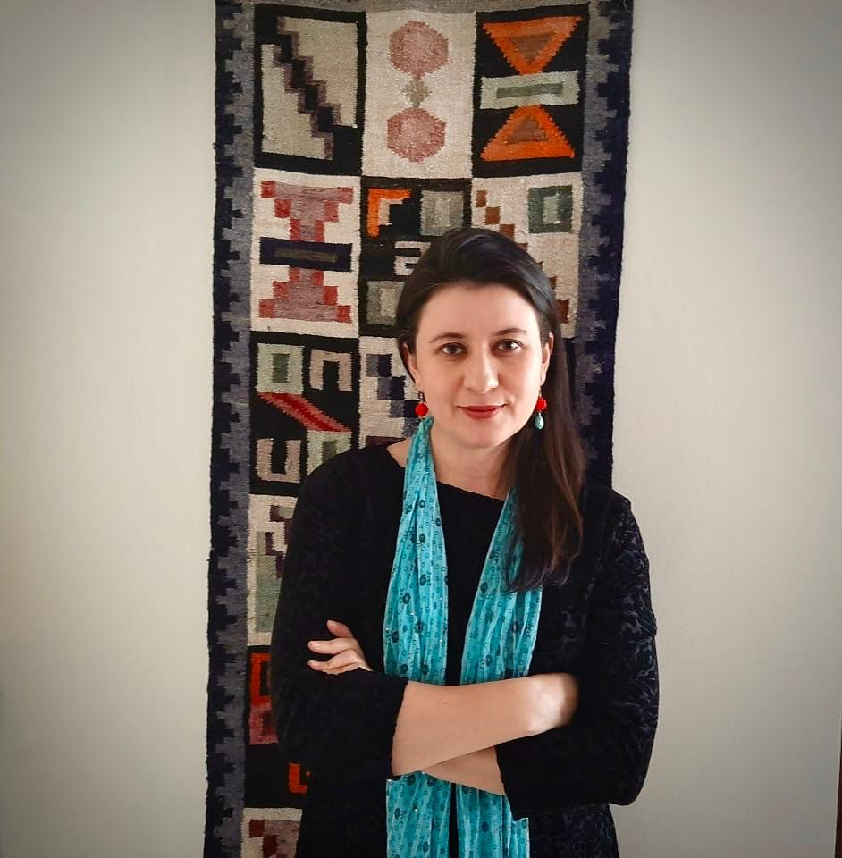

<link rel="stylesheet" href="styles.css" type="text/css">
<link rel="stylesheet" href="academicicons/css/academicons.min.css"/>

 

#### *Profile ane Education*

I am an Infectious Disease Epidemiologist with more than 10 years of experience with a particular focus in Latin America.

My background includes an MD at UPTC in Colombia, a Masters in Public Health at Universidad Nacional de Colombia and a PhD on Infectious Disease Epidemiology at Imperial College London. I did a postdoc with the Vaccine Impact Modelling Consortium in the UK. In 2017 I was awarded the MRC Rutherford Fund Fellowship.

 

#### _Academic Positions_

I hold a Research Fellow position in the [MRC Centre for Infectious Disease Epidemiology](https://www.imperial.ac.uk/people/zulma.cucunuba)  at Imperial College London in the UK. I also hold an academic appointment as Assistant Professor of Infectious Disease Epidemiology at Pontificia Universidad Javeriana in Colombia  [Department of Clinical Epidemiology.

 

#### *Research Focus*

My research focuses on using statistic and mathematical methods to understand the determinants of the spread of infection diseases and the impact of control strategies, with a particular focus in Latin America. 

Over the past 10 months my research has heavily focused on COVID-19, particularly in Latin America.

Over the past 10 years, I have worked on vector bone diseases including Chagas disease, Zika, Chikungunya and Malaria. Over the past three years I have been working on emerging infections, epidemic response and vaccine preventable diseases.

I am an avid R enthusiast for epidemic analytics and a member of the [R Epidemics Consortium (RECON)](https://www.repidemicsconsortium.org/people/). 

 

***

 

[RESEARCH & PUBLICATIONS](http://zulmamcucunuba.org/res_publications.html) 
 

 
[ACADEMIC TALKS](http://zulmamcucunuba.org/talks.html) 
 

 
[TEACHING MATERIALS](http://zulmamcucunuba.org/teaching.html) 
 

 
[MEDIA APPEARANCES](http://zulmamcucunuba.org/media.html) 
 

 
[CONTACT ME](http://zulmamcucunuba.org/contact.html) 
 

