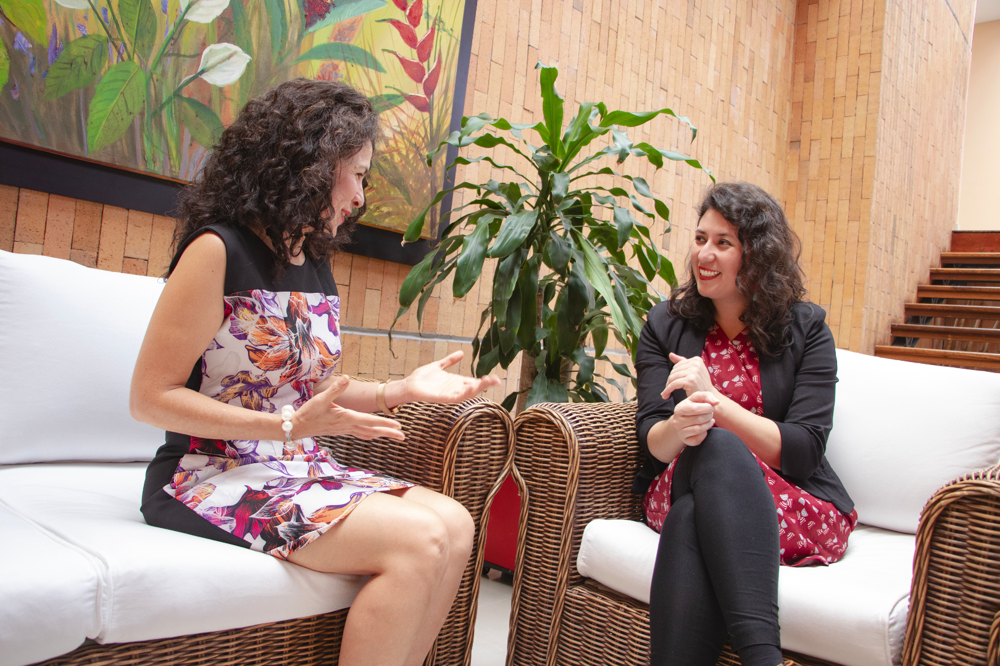

<link rel="stylesheet" href="styles.css" type="text/css">
<link rel="stylesheet" href="academicicons/css/academicons.min.css"/>

 

# Media Appearances

 

 
 

## Invited Podcast episodes

March 2020. [*El Hilo* COVID-19 La encrucijada de América Latina](shows.acast.com/elhilo/episodes/coronavirus-encrucijada)(Spanish) 

 

## TV Interviews

May 2020- [*Semana En Vivo* El reto: proteger la vida o salvar la economía del Covid-19 | Coronavirus Colombia](https://www.youtube.com/watch?v=wlyD2IZXL70&ab_channel=Mar%C3%ADaJimenaDuz%C3%A1nSV) (Spanish) 

 

## Newspaper Interviews

Sept 2020 [La experta “influencer” por Nicole Bravo, La Silla Vacía](https://lasillavacia.com/content/zulma-cucunuba-78036)

March 2020 ["Aplanar la curva no es suficiente: se proyectan cambios grandes en la forma como vivimos" Por: Pablo Correa/@pcorrea78  El Espectador](https://www.elespectador.com/coronavirus/aplanar-la-curva-no-es-suficiente-se-proyectan-cambios-grandes-en-la-forma-como-vivimos-articulo-912203/)

Feb 2020 ["La pregunta es si estamos preparados para la llegada del virus": Zulma Cucunubá Por: Pablo Correa/@pcorrea78 El Espectador](https://www.elespectador.com/noticias/salud/la-pregunta-es-si-estamos-preparados-para-la-llegada-del-virus-zulma-cucunuba-articulo-902545/)

 

## Outreach 

2020 - [Viaje a la cabeza de una epidemióloga Fundación Gabo](https://www.youtube.com/watch?v=QtVXu6GrOEk&ab_channel=Fundaci%C3%B3nGabo)(Spanish) 

2020 - [Medir y Gestionar la pandemia a largo plazo con Jorge Galindo - ESADE ](https://www.youtube.com/watch?v=CKddpHgf5fU&feature=emb_logo&ab_channel=Esade) (Spanish)

2020 - [Sígale la pista a estos hilos de tecnología,  innovación y ciencia](https://impactotic.co/sigales-la-pita-a-estos-hilos-recomendados-de-tecnologia-innovacion-y-ciencia/)

 

***

 

[RESEARCH & PUBLICATIONS](http://zulmamcucunuba.org/res_publications.html) 
 

 
[ACADEMIC TALKS](http://zulmamcucunuba.org/talks.html) 
 

 
[TEACHING MATERIALS](http://zulmamcucunuba.org/teaching.html) 
 

 
[MEDIA APPEARANCES](http://zulmamcucunuba.org/media.html) 
 

 
[CONTACT ME](http://zulmamcucunuba.org/contact.html) 
 

