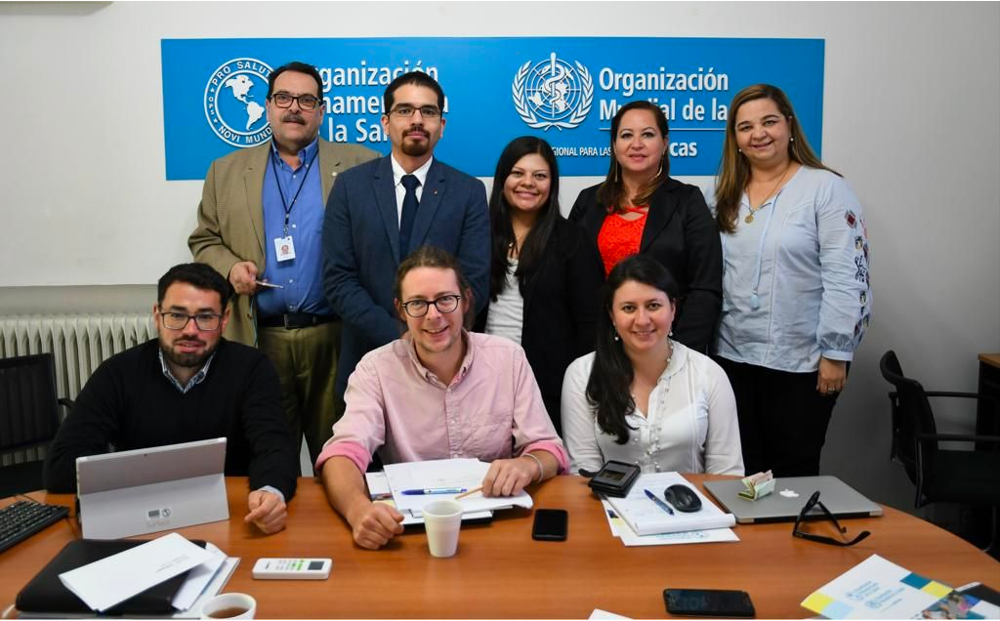

<link rel="stylesheet" href="styles.css" type="text/css">
<link rel="stylesheet" href="academicicons/css/academicons.min.css"/>

# Research and Publications
 

<!--  -->

 

## Ongoing Projects

- [DICTUM Platform: Decreasing the Impact of Trypanosoma cruzi Impact Thought Modelling](https://www.londonntd.org/news/decreasing-the-impact-of-chagas-disease-through-modelling)

- [The Global Burden of Chikungunya virus](https://gtr.ukri.org/projects?ref=MR%2FR024855%2F1)

- Imperial College COVID-19 Response Team

 
 

## Selected Publications

[Google Scholar profile](https://scholar.google.com/citations?user=YxVl1nUAAAAJ&hl=en)

[ORCID](https://orcid.org/0000-0002-8165-3198)

Biggerstaff M, Cowling BJ, Cucunubá ZM, Dinh L, Ferguson NM, et al., for the WHO COVID-19 Modelling Parameters Group. Early insights from statistical and mathematical modeling of key epidemiologic parameters of COVID-19. Emerg Infect Dis. 2020 https://doi.org/10.3201/eid2611.201074 

Verity R, Okell LC, Dorigatti I, Cucunubá ZM, (…) Donnelly CA, Ghani AC, Ferguson NM. Estimates of the severity of coronavirus disease 209: a model-based analysis. Lancet Infect Dis. 2020 30:S473-3099(20)30243-7.

Walker PGT, Whittaker C, Watson OJ, Cucunuba ZM, (…), Ferguson NM, Ghani AC. The impact of COVID- 19 and strategies for mitigation and suppression in low- and middle-income countries. Science. 2020;369(6502):413- 422

Laiton-Donato, Villabona-Arenas CJ (..), Cucunuba ZM. Genomic epidemiology of SARS-CoV-2 in Colombia. medRxiv 2020.06.26.20135715.

Ainslie KEC, Walters CE, Fu H, Bhatia (…) Cucunubá ZM. et al. Evidence of initial success for China exiting COVID-9 social distancing policy after achieving containment. Wellcome Open Res 2020, 5:8

Carrera JP, Cucunuba ZM, Neira K, et al. Endemic and epidemic human alphavirus infections in Eastern Panama, An Analysis of Population-Based Cross-Sectional Surveys. AmJTropMed: 2020.0.0.90462.

Li X, Mukandavire C, Cucunubá ZM, et al. Estimating the health impact of vaccination against 0 pathogens in 98 low- and middle-income countries from 2000 to 2030. medRxiv 209; : 9004358.

Cucunubá ZM, (..) Dobson A, Basañez MG. Insights from quantitative and mathematical modelling on the proposed WHO 2030 goals for Chagas disease. Gates Open Research 209, 3:539. doi.org/0.2688/gatesopenres.3069.

Castro MC, Baeza A, Codeço CT, Cucunubá ZM et al. Development, environmental degradation, and disease spread in the Brazilian AmazonPLoS Biol. 209;7():e3000526. doi: 0.37/journal.pbio.3000526.

Routledge I, Chevez JER, Cucunubá ZM, et al. Estimating spatiotemporally varying malaria reproduction numbers in a near elimination setting. Nature Commun. 208;9:2476.
Cucunubá ZM, Nouvellet P (…), Dobson AP, Basáñez MG. Complementary Paths to Chagas Disease Elimination: The 

Impact of Combining Vector Control with Etiological Treatment. Clin Infect Dis. 208;66:S293-S300.
Cucunuba ZM, Nouvellet P, Conteh L, et al., Modelling historical changes in the force-of-infection of Chagas disease to inform control and elimination programmes: application in Colombia. BMJ Glob Health. 207;2(3):e000345

Ferguson NM, Cucunubá ZM, Dorigati I, et al. Countering the Zika epidemic in Latin America. Science, 207 DOI: 0.26/science.aag029

 

***

 

[RESEARCH & PUBLICATIONS](http://zulmamcucunuba.org/res_publications.html) 
 

 
[ACADEMIC TALKS](http://zulmamcucunuba.org/talks.html) 
 

 
[TEACHING MATERIALS](http://zulmamcucunuba.org/teaching.html) 
 

 
[MEDIA APPEARANCES](http://zulmamcucunuba.org/media.html) 
 

 
[CONTACT ME](http://zulmamcucunuba.org/contact.html) 
 

